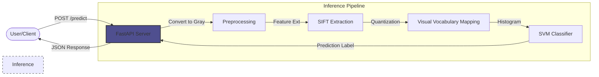

# Waste Classification via Bag of Visual Words (SIFT + SVM)

[](https://www.python.org/)
[](https://opencv.org/)
[](https://scikit-learn.org/)
[](https://jupyter.org/)

An automated waste classification system implementing Computer Vision and Machine Learning techniques to facilitate recycling efficiency. This project utilizes the Scale-Invariant Feature Transform (SIFT) for feature extraction and Support Vector Machines (SVM) for classification.

## 🏗️ Production Architecture

The system is designed to be served as a microservice. The following diagram illustrates the inference pipeline when deployed via FastAPI:



## 📖 Project Overview

The objective is to classify solid waste into six categories: **Cardboard, Glass, Metal, Paper, Plastic, and Trash**. This implementation uses a **Bag of Visual Words (BoVW)** approach, which provides a more interpretable pipeline than deep learning models by explicitly defining a visual vocabulary from local image features.

## 🛠️ Methodology

The system follows a classical Computer Vision pipeline:

1.  **Feature Extraction (SIFT)**: Detects local interest points and extracts descriptors invariant to scale, rotation, and illumination.
2.  **Vocabulary Building (K-Means)**: Clusters millions of extracted SIFT descriptors into a visual vocabulary of 250 words.
3.  **Vector Quantization**: Maps image features to the visual vocabulary, generating frequency histograms for each image.
4.  **Classification (SVM)**: Utilizes a Support Vector Machine with a Radial Basis Function (RBF) kernel for multi-class classification.

## 🧠 Technical Deep Dive

While modern deep learning (CNNs) dominates image classification, this project implements a **transparent pipeline** that focuses on explicit feature engineering:

- **SIFT vs. Deep Learning**: SIFT allows the model to remain effective even with smaller datasets by focusing on distinctive geometric structures (edges, corners) rather than requiring millions of parameters to learn low-level features from scratch.
- **K-Means as a Feature Compressor**: By clustering descriptors into a 250-word vocabulary, the system effectively compresses high-dimensional image data into a compact 250-dimension histogram, significantly reducing the computational cost of the final SVM classification.
- **Kernel Selection**: The **RBF Kernel** was chosen to handle the non-linear distribution of visual words in the feature space, allowing for more complex decision boundaries between similar categories (e.g., Plastic vs. Glass).

## 📊 Dataset: TrashNet

The model is trained and evaluated on the [TrashNet dataset](https://github.com/garythung/trashnet), consisting of 2,527 images of waste objects.

- **Training Set**: 85%
- **Test Set**: 15%

## 🚀 Quick Start

### 1. Installation

Ensure you have Python 3.10+ installed. Install the required libraries:

```bash
pip install -r requirements.txt
```

### 2. Run Inference Server (API)

A FastAPI server is provided for programmatic access.

```bash
python app.py
```

The server will start at `http://localhost:8000`. You can access the interactive API docs at [http://localhost:8000/docs](http://localhost:8000/docs).

### 3. Run Web Dashboard (User Interface)

For a more user-friendly experience, run the Streamlit dashboard:

```bash
streamlit run ui.py
```

This will open an interface in your browser where you can upload images and see the visual feature distribution.

## 📈 Results & Analysis

### Performance Metrics

The model exhibits a typical variance gap between training and testing, indicating sensitivity to lighting and background noise:

| Metric                | Accuracy  |
| :-------------------- | :-------- |
| **Training Accuracy** | **88.2%** |
| **Test Accuracy**     | **62.7%** |

> **Note:** Individual predictions may vary due to the classical nature of SIFT features compared to modern deep learning.

### Test Set Detailed Report

| Category      | Precision | Recall | F1-Score |
| :------------ | :-------- | :----- | :------- |
| **Paper**     | 0.766     | 0.800  | 0.783    |
| **Cardboard** | 0.667     | 0.689  | 0.677    |
| **Plastic**   | 0.640     | 0.658  | 0.649    |
| **Metal**     | 0.700     | 0.452  | 0.549    |
| **Glass**     | 0.448     | 0.618  | 0.519    |
| **Trash**     | 0.500     | 0.143  | 0.222    |

## 🔮 Limitations & Future Work

- **Overfitting**: The gap between training (88%) and test (63%) accuracy suggests the model is highly specialized to the training background/lighting.
- **Deep Learning Comparison**: While SIFT+SVM is transparent and efficient for small datasets, a Transfer Learning approach (e.g., using ResNet or EfficientNet) would likely yield >90% test accuracy.
- **Data Augmentation**: Future iterations should include geometric and color jittering to improve robustness.

## 📂 Repository Structure

- `ui.py`: Streamlit web dashboard.
- `app.py`: FastAPI inference server.
- `waste_classifier.ipynb`: Data pipeline, training, and evaluation notebook.
- `trashnet.pkl`: Serialized model, class names, and visual vocabulary.
- `requirements.txt`: Project dependencies.

---

_Developed by Adita Putri Puspaningrum._
