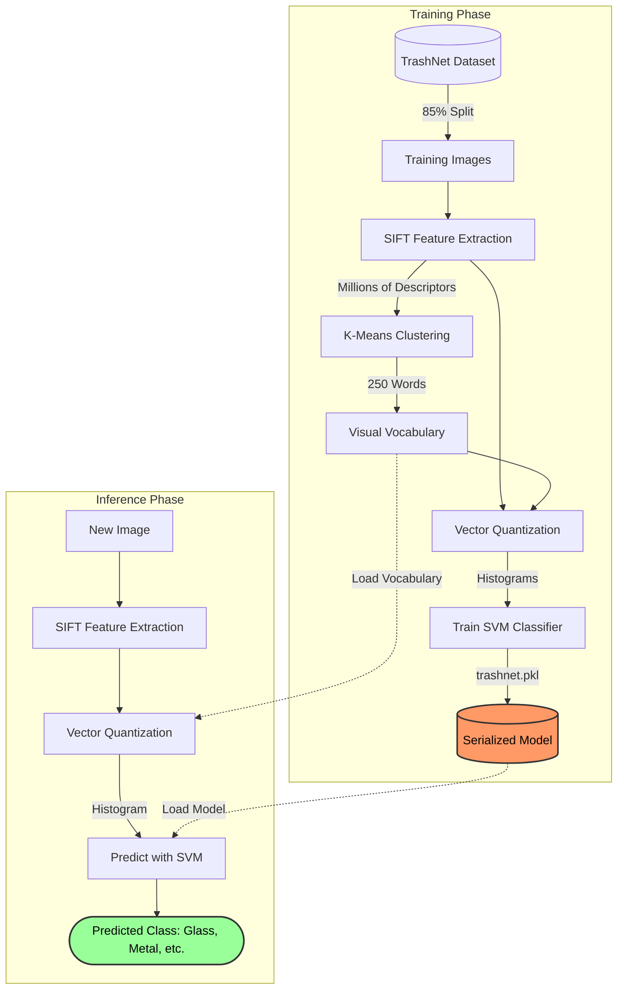

# Waste Classification via Bag of Visual Words (SIFT + SVM)

[](https://www.python.org/)
[](https://opencv.org/)
[](https://scikit-learn.org/)
[](https://jupyter.org/)

An automated waste classification system implementing Computer Vision and Machine Learning techniques to facilitate recycling efficiency. This project utilizes the Scale-Invariant Feature Transform (SIFT) for feature extraction and Support Vector Machines (SVM) for classification.

## 📊 System Pipeline



## 📖 Project Overview

The objective is to classify solid waste into six categories: **Cardboard, Glass, Metal, Paper, Plastic, and Trash**. The implementation follows a **Bag of Visual Words (BoVW)** pipeline, providing a transparent approach to feature quantification and classification compared to opaque end-to-end models.

## 🛠️ Methodology

The system follows a classical Computer Vision pipeline:

1.  **Feature Extraction (SIFT)**: Detects local interest points and extracts descriptors invariant to scale, rotation, and illumination.
2.  **Vocabulary Building (K-Means)**: Clusters millions of extracted SIFT descriptors into a visual vocabulary of 250 words.
3.  **Vector Quantization**: Maps image features to the visual vocabulary, generating frequency histograms for each image.
4.  **Classification (SVM)**: Utilizes a Support Vector Machine with a Radial Basis Function (RBF) kernel for multi-class classification.

## 🧠 Technical Deep Dive

While modern deep learning (CNNs) dominates image classification, this project implements a **transparent pipeline** that focuses on explicit feature engineering:

- **SIFT vs. Deep Learning**: SIFT allows the model to remain effective even with smaller datasets by focusing on distinctive geometric structures (edges, corners) rather than requiring millions of parameters to learn low-level features from scratch.
- **K-Means as a Feature Compressor**: By clustering descriptors into a 250-word vocabulary, the system effectively compresses high-dimensional image data into a compact 250-dimension histogram, significantly reducing the computational cost of the final SVM classification.
- **Kernel Selection**: The **RBF Kernel** was chosen to handle the non-linear distribution of visual words in the feature space, allowing for more complex decision boundaries between similar categories (e.g., Plastic vs. Glass).

## ⚙️ Backend Integration Potential

From a backend engineering perspective, the system is designed for **portability and integration**:

- **Model Serialization**: Using `joblib`, the trained SVM classifier and the visual vocabulary (`voc`) are serialized into a single `trashnet.pkl` file. This allows the model to be loaded into a production environment (such as a FastAPI or Flask microservice) without retraining.
- **Inference Pipeline**: The inference logic is decoupled from training. To process a new request, the backend only needs to:
  1.  Perform SIFT extraction on the input image.
  2.  Quantize features using the pre-loaded vocabulary.
  3.  Run the prediction via the SVM.
- **Decoupled Architecture**: The data extraction and organizing logic are scripted to ensure that the dataset pipeline is reproducible and can be easily adapted for different data sources.

## 📊 Dataset: TrashNet

The model is trained and evaluated on the [TrashNet dataset](https://github.com/garythung/trashnet), consisting of 2,527 images of waste objects.

- **Training Set**: 85%
- **Test Set**: 15%

## 🚀 Installation & Requirements

This project is compatible with Python environments version 3.10 and above.

```bash
pip install opencv-contrib-python numpy scipy scikit-learn joblib matplotlib seaborn pandas
```

## 📈 Results

Evaluation results on the test set:

| Category      | Precision | Recall | F1-Score |
| :------------ | :-------- | :----- | :------- |
| **Paper**     | 0.766     | 0.800  | 0.783    |
| **Cardboard** | 0.667     | 0.689  | 0.677    |
| **Plastic**   | 0.640     | 0.658  | 0.649    |
| **Metal**     | 0.700     | 0.452  | 0.549    |
| **Glass**     | 0.448     | 0.618  | 0.519    |
| **Trash**     | 0.500     | 0.143  | 0.222    |

**Overall Test Accuracy: 62.7%**

## 📂 Repository Structure

- `Waste_Classifier.ipynb`: Complete pipeline from data extraction to evaluation.
- `trashnet.pkl`: Pre-trained SVM model and visual vocabulary.

---

_Developed by Adita Putri Puspaningrum._
